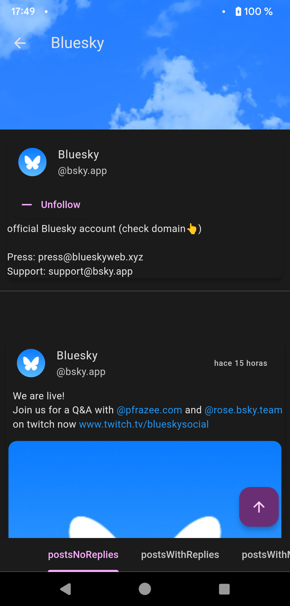

# LightBluesky

  

A Bluesky client made using Flutter, designed to be lightweight and easy to use.

**WIP**: The project is _usable_ but still being developed, expect some issues.

## Installation
You will need flutter, it is tested for the `stable` version.

### Linux
You will need `libmpv` for handling video playback.

## Implemented
* Auth
  * 2FA
  * Different service
* Home
  * Timeline (Following)
  * Pinned feeds
* Search
  * Users
* Feeds
* Profile
  * Own
  * Others
* Posting
  * Reply to post
  * New post
  * Attach Media (images only)
* Posts
  * Handle adult content
  * Sharing
  * Like / Repost
* Translations
  * English
  * Spanish

## TODO
* Group timeline posts
* Block / unblock
* Add documentation
* Make tests
* Use SecureStorage for session data?

## Credits
This project wouldn't have been posible without the help of these third-party projects:
- [bluesky & bluesky_text](https://atprotodart.com/)
- [shared_preferences](https://github.com/flutter/packages/tree/main/packages/shared_preferences/shared_preferences)
- [url_launcher](https://github.com/flutter/packages/tree/main/packages/url_launcher/url_launcher)
- [dynamic_color](https://github.com/material-foundation/flutter-packages/tree/main/packages/dynamic_color)
- [package_info_plus](https://github.com/fluttercommunity/plus_plugins)
- [file_picker](https://github.com/miguelpruivo/flutter_file_picker)
- [get_time_ago](https://pub.dev/packages/get_time_ago)
- [video_player](https://github.com/flutter/packages/tree/main/packages/video_player/video_player)
- [media_kit & video_player_media_kit](https://github.com/media-kit/media-kit)
- [share_plus](https://pub.dev/packages/share_plus)
- [flutter_cache_manager](https://github.com/Baseflow/flutter_cache_manager/tree/develop/flutter_cache_manager)
- [cached_network_image](https://github.com/Baseflow/flutter_cached_network_image)
- [photo_view](https://github.com/bluefireteam/photo_view)
- [flutter_native_splash](https://github.com/jonbhanson/flutter_native_splash)
